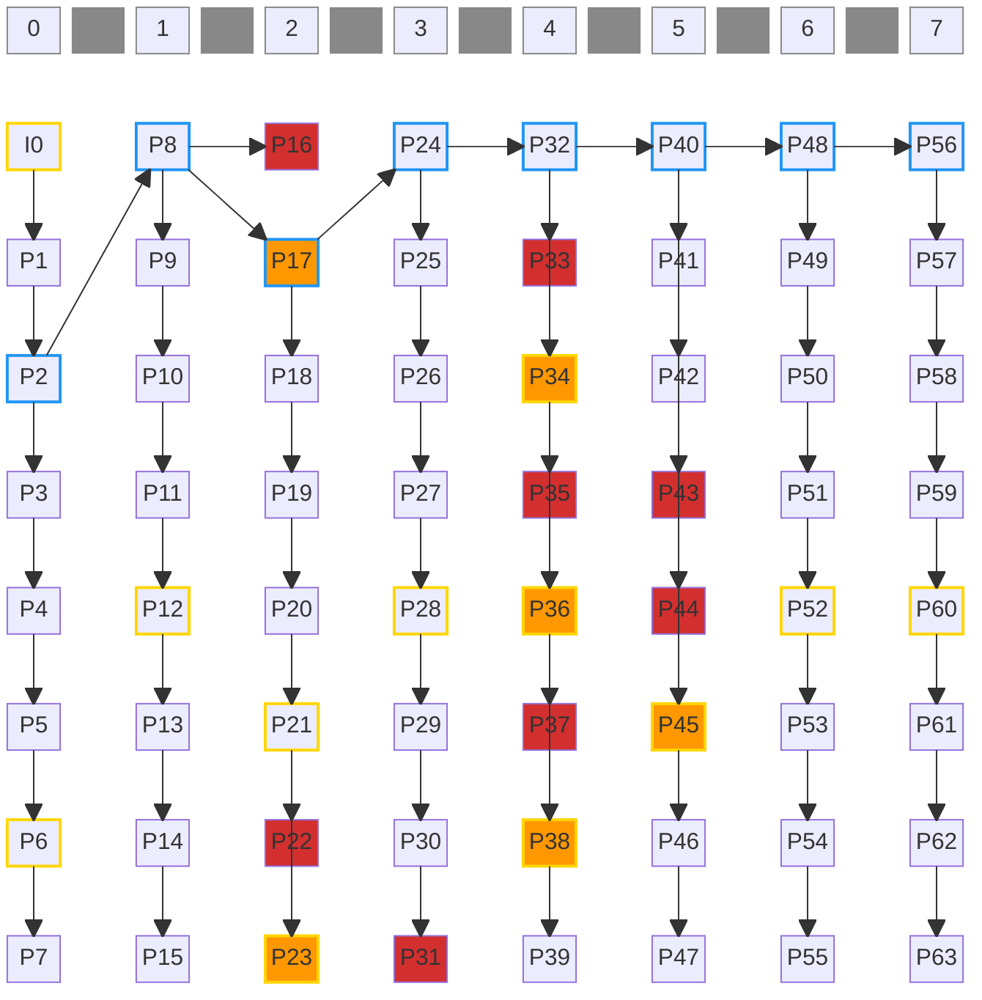

# LTR management and recovery design

## Definitions

- **Root LTR:** an LTR frame with bounded prediction-chain length, created at branch start (near IDR or via proactive recovery), serving as the recovery reference for proactive recovery.
- **LTR branch:** a contiguous prediction lineage anchored by a root LTR, starting after IDR or proactive recovery.
- **In-branch LTR:** an LTR frame marked within an LTR branch, serving as a recovery reference for loss events inside that branch.
- **Branch depth:** number of base-layer frames since branch start.

## Design principles

1. **Scope:** this document covers internal LTR mode only.
1. **Interface contract:** external hints provide decoder-known-good state for invalidation only; external LTR marking requests are ignored; all marking and reference selection is internal to the encoder.
1. **Behavioral rule:** only base-layer frames (`temporalId == 0`) advance LTR state, counters, and cadence; enhancement layers do not affect LTR behavior.
1. **Proactive policy:** proactive recovery starts a new branch from the most recent root LTR when branch depth reaches a configured threshold (`recoveryThreshold`), bounding worst-case prediction-chain length. Because branch depth counts base-layer frames, the threshold can be crossed on an enhancement-layer frame; the branch-full trigger is gated to base-layer frames so a new branch root is never placed on an enhancement frame (recovery defers to the next base-layer frame).
1. **In-branch recovery:** in-branch LTRs are marked periodically (`ltrPeriod`) within an LTR branch; external recovery uses the nearest surviving in-branch LTR without starting a new branch.

## Config variables (`EncoderConfig`)

| Field | Example | Purpose |
|-------|---------|---------|
| `ltrStartIdx` | 2 | First root LTR is marked on the first base-layer frame where `frameIdx >= ltrStartIdx` (0 = mark root on the first frame) |
| `ltrPeriod` | 4 | In-branch LTR marking interval in base-layer frames (0 = LTR disabled). Also used as a factor in `recoveryThreshold`. |
| `ltrNumSlots` | 4 | Number of LTR slots available (minimum 2 when proactive recovery enabled, minimum 1 otherwise) |
| `ltrRecoveryPeriod` | 2 | Multiplier for proactive recovery: derived `recoveryThreshold = ltrPeriod * ltrRecoveryPeriod` frames (0 = no proactive recovery, LTR marking + external recovery only) |


## Illustration

Uses the example config above (`numTemporalLayers = 1`). Each column is one LTR branch.



Legend:
- **Fill:**  orange = recovery frame, 🔴 red = lost frame
- **Border:** 🔵 blue = root LTR, 🟨 gold = in-branch LTR

**Branch details:**

| Branch | Frames | Scenario |
|--------|--------|----------|
| 0 | I0-P7 | **Normal:** IDR at I0 (in-branch LTR), root delayed to P2 (`ltrStartIdx=2`), periodic LTR at P6 |
| 1 | P8-P15 | **Normal:** Proactive root at P8, periodic LTR at P12 |
| 2 | P16-P23 | **Proactive + inline recovery:** P16 lost -> P17 new root from P8. P22 lost -> P23 inline recovery from P21 |
| 3 | P24-P31 | **Non-LTR loss:** P31 lost (not an LTR, no impact on recovery state) |
| 4 | P32-P39 | **Repeated alternating loss:** P33, P35, P37 lost -> P34 recovers from P32 (root), P36 from P34, P38 from P36 |
| 5 | P40-P47 | **Lost recovery frame:** P43 lost, P44 (recovery from P40) also lost -> P45 successful recovery from P40 |
| 6 | P48-P55 | **Normal:** No losses |
| 7 | P56-P63 | **Normal:** No losses |


## Class design

Three classes: `LtrSlots` (slot bookkeeping), `LtrManager` (owner, orchestrates marking + recovery), and `LtrBranch` (active branch). `LtrBranch` holds references to `EncoderConfig` and `LtrSlots`.

LtrManager gates on base-layer frames (`temporalId != 0` → skip) and `ltrPeriod == 0` (LTR disabled → skip). For marking, it delegates to `m_branch.UpdateFrameMarking(...)`. For recovery, it coordinates invalidation across both `m_slots` and `m_branch`, then decides between proactive (new branch) and in-branch (same branch) recovery.

### LtrSlots

**Dependencies:** `ltrNumSlots` (from config)

**State:**

| Member | Type | Purpose |
|--------|------|---------|
| `m_slots` | `std::array<LtrSlotInfo, MAX_LTR_SLOTS>` | Physical LTR slot storage |
| `m_isRoot` | `std::array<bool, MAX_LTR_SLOTS>` | Per-slot root flag (up to 2 newest roots protected from eviction in `Acquire()`) |

**Public methods:**

| Method | Purpose |
|--------|---------|
| `Reset()` | Clear all slots and root flags |
| `InvalidateFramesAfter(frameIdx)` | Invalidate all slots newer than given frame |
| `Mark(slotIdx, frameIdx, isRoot)` | Write slot and set root flag |
| `Acquire()` | Find best slot (free -> oldest non-root -> oldest any); invalidates evicted slot |
| `FindLatestFrameIdx(rootOnly, lastValidFrameIdx)` | Pure query: return the largest `frameIdx <= *lastValidFrameIdx` (or unbounded when `lastValidFrameIdx == nullopt`), or `nullopt` if no slot qualifies. When `rootOnly`, only consider slots where `m_isRoot[i]` is true. Callers use `lastValidFrameIdx` to simulate `InvalidateFramesAfter(*lastValidFrameIdx)` without mutating state. |
| `GetSlots() const` | Read-only access to slot array |

### LtrBranch

**Dependencies:** `const EncoderConfig&`, `LtrSlots&`

**State:**

| Member | Type | Purpose |
|--------|------|---------|
| `m_branchId` | `int` | Branch number (0 = first after IDR, incremented on proactive recovery) |
| `m_rootFrameIdx` | `std::optional<int>` | Frame index of this branch's root LTR (`nullopt` = not yet marked) |
| `m_branchDepth` | `int` | Frames since branch start (how deep into this branch) |
| `m_ltrMarkingCounter` | `int` | Increments each frame, resets to 0 when in-branch LTR is marked |

**Public methods:**

| Method | Purpose |
|--------|---------|
| `Reset()` | Reset all state to initial (branch 0) |
| `InvalidateFramesAfter(frameIdx)` | Clear root tracking if root frame was lost |
| `ComputeProactiveRecoveryFrameIdx(lastValidFrameIdx, isBaseLayerFrame)` | Pure query: if proactive recovery is needed, return the root frame to recover from. Returns `nullopt` if not needed, error if all roots lost. Skips slots whose `frameIdx > *lastValidFrameIdx`, simulating `InvalidateFramesAfter(*lastValidFrameIdx)` without mutating state. `isBaseLayerFrame` (default `true`) gates the branch-full trigger. |
| `UpdateFrameMarking(frameIdx, isRecovery)` | Mark root or in-branch LTR, increment counters. Called only for base-layer frames. When `isRecovery` is true, the recovery-commit prologue starts a new branch via `NeedsProactiveRecovery()` + `StartNewBranch()` before the marking steps run. |

**Private methods:**

| Method | Purpose |
|--------|--------|
| `NeedsProactiveRecovery(lastValidFrameIdx, isBaseLayerFrame)` | Returns `true` if proactive recovery should trigger. `isBaseLayerFrame` (default `true`) gates the branch-full trigger; root-lost recovery is not gated. |
| `StartNewBranch()` | Increment `m_branchId`, reset depth/root/counter |

### LtrManager

**Dependencies:** `const EncoderConfig&`

**State:**

| Member | Type | Purpose |
|--------|------|---------|
| `m_slots` | `LtrSlots` | LTR slot management |
| `m_branch` | `LtrBranch` | The one active branch |

**Public methods:**

| Method | Purpose |
|--------|---------|
| `Reset()` | Reset slots and branch (IDR) |
| `ComputeRecoveryFrameIdx(useLtrSlotIdx, temporalId)` | Pure decision-only query: returns the frame to recover from (proactive or external) without mutating state. **Must be called for every frame** (not only base-layer frames, and not only when an external hint is present); proactive recovery depends on this, and `temporalId` is the natural (pre-recovery) layer used to gate the branch-full trigger to base-layer frames. The corresponding state mutation is applied by `UpdateFrameMarking` when `isRecovery == true`. |
| `UpdateFrameMarking(frameIdx, temporalId, isRecovery, useLtrSlotIdx)` | Commits any pending recovery (invalidates the `useLtrSlotIdx` slot when `isRecovery`) and then performs base-layer marking by delegating to `m_branch.UpdateFrameMarking`, which runs its own recovery-commit prologue (`NeedsProactiveRecovery()` + `StartNewBranch()`). `isRecovery` is set to `true` by `MlvcEncoderCore` when `ComputeRecoveryFrameIdx` returned a recovery frame for this frame. |

**Private methods:**

| Method | Purpose |
|--------|---------|
| `InvalidateFramesAfter(frameIdx)` | Invalidate slots + branch root tracking for all frames newer than `frameIdx` |

## IDR reset flow logic

Called by `MlvcEncoderCore` when an IDR frame is produced (before marking). IDR resets `frameIdx` to 0.

1. `LtrManager::Reset()`:
   - `m_slots.Reset()`  - clear all LTR slots and protected list
   - `m_branch.Reset()`  - reset branch state: `m_branchId = 0`, `m_branchDepth = 0`, `m_rootFrameIdx = nullopt`, `m_ltrMarkingCounter = 0`
2. `UpdateFrameMarking(0, temporalId, false, std::nullopt)`  - When `ltrStartIdx > 0`: IDR frame is marked as in-branch LTR via step 2 (`frameIdx == 0`). When `ltrStartIdx == 0` and `recoveryThreshold > 0`: IDR frame is marked as root via step 1. When `ltrStartIdx == 0` and `recoveryThreshold == 0`: IDR frame is marked as in-branch LTR via step 2 (step 1 guard fails)

## LTR slot management logic (`LtrSlots`)

All LTR slot writes go through `LtrSlots` methods. The branch calls `m_slots.Mark(...)` etc.

### LtrSlots::Mark(slotIdx, frameIdx, isRoot)

1. Write `m_slots[slotIdx] = LtrSlotInfo{frameIdx}` and set `m_isRoot[slotIdx] = isRoot`

### LtrSlots::Acquire()

1. Return first free (empty) slot
2. Count root slots. If `rootCount <= 2`: return oldest non-root slot (roots are protected)
3. Return oldest slot (fallback: excess roots not protected, all slots are roots, or `numSlots <= 2`)

Invalidates the evicted slot before returning (steps 2–3).

## LTR marking logic

### LtrManager::UpdateFrameMarking(frameIdx, temporalId, isRecovery, useLtrSlotIdx)

1. Skip if `temporalId != 0` (only base-layer frames can be LTR)
2. Skip if `ltrPeriod == 0` (LTR disabled)
3. Delegate to `m_branch.UpdateFrameMarking(frameIdx, isRecovery)`

### LtrBranch::UpdateFrameMarking(frameIdx, isRecovery)

**Prologue (recovery commit):** if `isRecovery` and `NeedsProactiveRecovery()` holds, call `StartNewBranch()` to commit the pending proactive recovery (no-op otherwise). This runs before the marking steps so a recovery frame can immediately be marked as the new branch's root via step 1.

1. If `recoveryThreshold > 0` and branch has no root (`!m_rootFrameIdx`) and `frameIdx >= ltrStartIdx`: **mark as protected root LTR frame**, reset `m_ltrMarkingCounter = 0`
2. Else if `isRecovery` or `frameIdx == 0` or (`ltrPeriod > 0` and `m_ltrMarkingCounter >= ltrPeriod`): **mark as in-branch LTR frame**, reset `m_ltrMarkingCounter = 0`
3. Increment `m_branchDepth` and `m_ltrMarkingCounter`

**Note on branch creation:** Recovery logic decides when to create a new branch and picks the best available LTR as the reference. The new branch starts with `m_rootFrameIdx = nullopt` and marks its own root via the same step 1 logic.

**Special cases:**
- **Root LTR lost:** Recovery logic is responsible for handling root loss (e.g., trigger IDR or create a new root LTR frame via proactive recovery). Marking can assume that if there is no root, then next frame is safe to mark as root.
- **In-branch recovery frame:** Marked as in-branch LTR, never as root (long prediction chain). Root LTRs are created only via proactive recovery (short chain) or after IDR. When proactive recovery is disabled (`recoveryThreshold == 0`), step 1 is skipped entirely: no roots are marked, and all LTRs are in-branch.

## LTR recovery logic

### 1. Invalidation

When external recovery is requested, it means some frames are lost. All frames newer than the latest good frame are considered lost and their LTR slots must be invalidated. Each layer handles its own state:

#### LtrSlots::InvalidateFramesAfter(frameIdx)

1. For each slot: if `HasValue()` and slot `frameIdx > frameIdx` -> `Invalidate(slotIdx)`
   - Uses existing `Invalidate()` which clears the slot and sets `m_isRoot[slotIdx] = false`

#### LtrBranch::InvalidateFramesAfter(frameIdx)

1. If `m_rootFrameIdx` has value and `*m_rootFrameIdx > frameIdx` -> `m_rootFrameIdx = nullopt`

#### LtrManager::InvalidateFramesAfter(frameIdx)

1. `m_slots.InvalidateFramesAfter(frameIdx)`  - invalidate slots + protected list
2. `m_branch.InvalidateFramesAfter(frameIdx)`  - update branch root tracking

Called from `LtrManager::UpdateFrameMarking`'s slot-invalidation prologue when external invalidation is requested. `ComputeRecoveryFrameIdx` only *simulates* this invalidation via the `lastValidFrameIdx` argument it forwards to `LtrSlots::FindLatestFrameIdx` and `LtrBranch::ComputeProactiveRecoveryFrameIdx`; the real mutation runs in `UpdateFrameMarking`'s prologue. `UpdateFrameMarking` is infallible; all fallibility lives in `ComputeRecoveryFrameIdx`.

### 2. Proactive recovery

Proactive recovery creates a new branch by recovering from a root LTR frame. The decision is a pure query (`ComputeProactiveRecoveryFrameIdx`); the commit is the `NeedsProactiveRecovery()` + `StartNewBranch()` pair that runs in the recovery-commit prologue at the top of `LtrBranch::UpdateFrameMarking` whenever `isRecovery` is true.

#### LtrBranch::ComputeProactiveRecoveryFrameIdx(lastValidFrameIdx, isBaseLayerFrame)

1. If `!NeedsProactiveRecovery(lastValidFrameIdx, isBaseLayerFrame)` -> return `nullopt` (not needed). When `lastValidFrameIdx` has value, `NeedsProactiveRecovery()` is evaluated as if `InvalidateFramesAfter(*lastValidFrameIdx)` had been applied (without mutating state).
2. `rootFrameIdx = m_slots.FindLatestFrameIdx(rootOnly: true, lastValidFrameIdx: lastValidFrameIdx)`
3. If `!rootFrameIdx` -> return error (IDR fallback, all roots lost)
4. Return `*rootFrameIdx`

#### Branch-commit step (recovery-commit prologue of `LtrBranch::UpdateFrameMarking`)

1. If `isRecovery` and `NeedsProactiveRecovery()` -> `StartNewBranch()` (increment `m_branchId`, reset depth/root/counter). Else -> no-op.

The new branch's root LTR is marked via marking step 1 on the next eligible base-layer frame (typically the recovery frame itself).

#### LtrBranch::NeedsProactiveRecovery(lastValidFrameIdx, isBaseLayerFrame) (private)

1. If `recoveryThreshold <= 0` -> return `false` (proactive recovery disabled)
2. If `m_rootFrameIdx.has_value()` and `m_branchDepth >= recoveryThreshold` and `isBaseLayerFrame` -> return `true` (branch full)
3. If `m_branchId > 0` and `!m_rootFrameIdx.has_value()` -> return `true` (root lost)
4. Return `false`

Step 2 (**branch full**): prediction chain has grown enough, time for a fresh root. Requires a root to exist (otherwise it's just "not yet marked", not "full"). Gated on `isBaseLayerFrame` because a new branch root must be a base-layer frame; branch depth counts only base-layer frames, so the threshold can first be crossed on an enhancement frame, which must defer to the next base-layer frame. The recovery-commit prologue calls `NeedsProactiveRecovery()` with the default `isBaseLayerFrame = true`, which is correct because the manager only delegates to it for base-layer frames (`temporalId == 0`).
Step 3 (**root lost**): root was invalidated by loss, need to recover from a previous root. Not gated on `isBaseLayerFrame`; loss recovery must not be deferred. `m_branchId > 0` guards against branch 0 before its root is marked; that's not loss, the root is established via marking step 1.

### 3. External recovery (in-branch)

When external loss is reported but proactive recovery doesn't trigger, the encoder recovers from the best available in-branch LTR.

**Reference selection:** If `useLtrSlotIdx` points to a valid (non-invalidated) slot, use that frame as recovery reference. Otherwise, find the newest surviving LTR in slots (simulated via `FindLatestFrameIdx(rootOnly: false, lastValidFrameIdx: invalidateAfter)`).

**Fallback:** If no LTR survives -> return error -> `DecideFrameType` falls back to IDR.

**No branch reset**  - the branch continues, the recovery frame becomes an in-branch LTR (via marking step 2 with `isRecovery=true`).

### 4. ComputeRecoveryFrameIdx (full flow)

#### LtrManager::ComputeRecoveryFrameIdx(useLtrSlotIdx, temporalId)

Pure decision-only query: does not mutate `LtrManager` state. The matching state mutation runs in `UpdateFrameMarking` (slot invalidation in `LtrManager::UpdateFrameMarking`, branch commit in `LtrBranch::UpdateFrameMarking`). `temporalId` is the natural (pre-recovery) layer of the frame being decided; it is translated to `isBaseLayerFrame = (temporalId == 0)` and forwarded to the proactive query.

1. If `ltrPeriod == 0` and no `useLtrSlotIdx` -> return `nullopt` (LTR disabled, no recovery). When `useLtrSlotIdx` IS provided with `ltrPeriod == 0`, the flow continues to step 2 so an explicit external hint can still resolve in this degenerate config.
2. If `useLtrSlotIdx` provided:
   - If slot is empty -> warn, clear `useLtrSlotIdx` (stale hint, continue as if no hint)
   - Else -> set `invalidateAfter = m_slots[*useLtrSlotIdx].frameIdx` (simulated invalidation passed into the calls below; no mutation here)
3. `proactiveFrameIdx = m_branch.ComputeProactiveRecoveryFrameIdx(lastValidFrameIdx: invalidateAfter, isBaseLayerFrame: temporalId == 0)`
   - If error -> return error (IDR fallback, all roots lost)
   - If has value -> return it
4. Else if `useLtrSlotIdx` was provided:
   - If `useLtrSlotIdx` slot is still valid (after the simulated invalidation) -> return its `frameIdx`
   - Else -> `m_slots.FindLatestFrameIdx(rootOnly: false, lastValidFrameIdx: invalidateAfter)` -> return
   - If no LTR survives -> return error (IDR fallback)
5. Else -> return `nullopt` (no recovery)

#### LtrManager::UpdateFrameMarking(frameIdx, temporalId, isRecovery, useLtrSlotIdx) (commit phase)

Called by `MlvcEncoderCore::Encode` AFTER all fallible encoding work has succeeded, so a failure during encode leaves the manager state untouched (GopManager-style read-then-mutate).

1. **Slot invalidation prologue** (runs before the `temporalId` gate so the recovery's invalidation commits even when the recovery frame is non-base-layer; in current usage `isRecovery` implies base layer):
   - If `isRecovery` and `useLtrSlotIdx` points to a valid slot -> `InvalidateFramesAfter(m_slots[*useLtrSlotIdx].frameIdx)`
2. If `temporalId != 0` -> return (only base-layer frames can be LTR)
3. If `ltrPeriod == 0` -> return (LTR disabled)
4. Delegate to `m_branch.UpdateFrameMarking(frameIdx, isRecovery)`. The branch-commit step (`NeedsProactiveRecovery()` + `StartNewBranch()`) runs at the top of that call when `isRecovery` is true.

### IDR fallback edge cases

`ComputeRecoveryFrameIdx` returns error (causing `DecideFrameType` to produce IDR) in two cases:

1. **All roots lost** (step 3): `ComputeProactiveRecoveryFrameIdx()` returns error: proactive recovery was needed but `FindLatestFrameIdx(rootOnly: true, lastValidFrameIdx: invalidateAfter)` returned `nullopt`. The proactive chain is broken beyond repair.
2. **No LTR survives** (step 4): External hint was provided, hint slot is invalid after the simulated invalidation, and `FindLatestFrameIdx(rootOnly: false, lastValidFrameIdx: invalidateAfter)` returns `nullopt` - all slots are empty. Total loss.

Both are catastrophic loss scenarios. Note that older non-root LTR slots (e.g. the IDR frame) are typically already evicted by the time we reach branch N, so recovering from them is not an option.

**Stale hint** (step 2): If `useLtrSlotIdx` points to an empty slot, the hint is ignored with a warning and the flow continues as if no hint was provided. This handles post-IDR stale hints gracefully without forcing an unnecessary IDR.

## Edge cases

1. **`ltrNumSlots` requirements:** When proactive recovery is enabled (`recoveryThreshold > 0`), `ltrNumSlots >= 2` is required so that the current branch root is always the newest root (by `m_isRoot` flag) and `Acquire()` step 3 evicts the **oldest** slot (previous root). When proactive recovery is disabled (`recoveryThreshold == 0`), `ltrNumSlots >= 1` is sufficient - root protection is not needed and the single slot holds in-branch LTRs only. Note: `m_rootFrameIdx` tracks the root by frame index (not slot index), so even if a slot is reused, the branch correctly detects root loss via `InvalidateFramesAfter`.
2. **`ltrRecoveryPeriod=0` (no proactive recovery):** `ComputeProactiveRecoveryFrameIdx()` returns `nullopt` because `NeedsProactiveRecovery()` checks `recoveryThreshold > 0` first. Both triggers (branch full, root lost) are disabled. Single branch for the entire GOP. LTR marking and external recovery still work normally.
3. **`ltrPeriod=0` (LTR disabled):** `UpdateFrameMarking` and `ComputeRecoveryFrameIdx` skip entirely. No LTR marking, no proactive or external recovery. Slots remain empty.
4. **`ltrNumSlots=2`:** Root + 1 in-branch LTR. When both slots hold roots (right after two proactive recoveries), `Acquire()` hits step 3 fallback (oldest slot). Functional but tight.
5. **Recovery frame itself lost:** Encoder marks recovery frame as in-branch LTR, but it's lost in transit. Next external hint points back to the same pre-loss reference. `InvalidateFramesAfter` clears the lost recovery frame's slot. Encoder re-recovers from the same surviving LTR. Handled correctly (see illustration branch 5).
6. **LTR frame lost after marking:** The encoder marks an LTR frame and it occupies a slot, but it never reaches the decoder (e.g., F0 after IDR, or any in-branch/root LTR lost in transit without a subsequent hint invalidating it). The LTR manager cannot detect this; the slot is valid from the encoder's perspective. If a hint arrives pointing to that slot, the encoder "recovers" from a frame the decoder doesn't have (useless). If no hint arrives, `ComputeRecoveryFrameIdx` returns `nullopt` (no recovery). In both cases, IDR must come from a higher layer (e.g., repeated PLI → `DecideFrameType` forces IDR).
7. **`ltrStartIdx < ltrPeriod` precondition:** Config validation enforces `ltrStartIdx < ltrPeriod` when proactive recovery is enabled (`recoveryThreshold > 0`). This guarantees the root LTR (marking step 1) is always marked before any periodic in-branch LTR (marking step 2) in branch 0. When proactive recovery is disabled (`recoveryThreshold == 0`), `ltrStartIdx` is unused (marking step 1 never fires).

## Prediction chain length analysis

Each proactive recovery references the previous root LTR, adding exactly 1 step to the absolute prediction chain from IDR. The root-to-root chain grows linearly across branches:

```
Root chain: P2(2) → P8(3) → P16(4) → P24(5) → P32(6) → P40(7) → P48(8) → P56(9)
```

Within each branch, up to `recoveryThreshold - 1` additional sequential prediction steps accumulate. The worst-case prediction chain (at the last frame before the next IDR) is:

```
max_chain = ltrStartIdx + iframePeriod / recoveryThreshold + recoveryThreshold - 2
```

For the example config: `2 + 64/8 + 8 - 2 = 16` (at P63).

Without proactive recovery the chain would reach `iframePeriod - 1 = 63`, so proactive recovery gives a ~4× reduction.

**Loss cannot increase the chain.** Every recovery (proactive or in-branch) references an earlier frame, shortening the chain. `branchDepth` increments regardless of loss, so proactive recovery fires on schedule. Root loss triggers recovery from the previous root (shorter chain) or IDR (chain = 0). The no-loss case is the worst case.

### Slot occupancy trace (example config, `ltrNumSlots = 4`)

Shows slot contents at each branch boundary to verify root protection and eviction order.

| Event | Slot 0 | Slot 1 | Slot 2 | Slot 3 | `m_isRoot[]` |
|-------|--------|--------|--------|--------|--------------------|
| After branch 0 (I0-P7) | I0 (in-branch) | P2 (root) | P6 (in-branch) | (empty) | [F, T, F, F] |
| After branch 1 (P8-P15) | P12 (in-branch, evicts I0) | P2 (root) | P6 (in-branch) | P8 (root) | [F, T, F, T] |
| After branch 2 (P16-P23) | P12 | P20 (in-branch, evicts P2) | P16 (root, evicts P6) | P8 (root) | [F, F, T, T] |
| After branch 3 (P24-P31) | P24 (root, evicts P12) | P20 | P16 (root) | P28 (in-branch, evicts P8) | [T, F, T, F] |
| After branch 4 (P32-P39) | P24 (root) | P32 (root, evicts P20) | P36 (in-branch, evicts P16) | P28 | [T, T, F, F] |
| After branch 5 (P40-P47) | P44 (in-branch, evicts P24) | P32 (root) | P36 | P40 (root, evicts P28) | [F, T, F, T] |
| After branch 6 (P48-P55) | P44 | P52 (in-branch, evicts P32) | P48 (root, evicts P36) | P40 (root) | [F, F, T, T] |
| After branch 7 (P56-P63) | P56 (root, evicts P44) | P52 | P48 (root) | P60 (in-branch, evicts P40) | [T, F, T, F] |

Eviction order: free → oldest non-root (if ≤ 2 roots) → oldest any. Up to two roots are protected from eviction.
